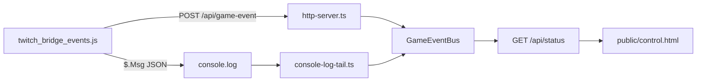

# Мод событий Deadlock и журнал в bridge

Фаза 1 — только телеметрия. Twitch Predictions не трогаем.

Сейчас мост односторонний (Twitch → эффекты). Добавляем обратный канал: **игра → bridge → GUI**.



## Решение по аддону

Не делать второй VPK: два мода с `hud.xml` конфликтуют (это уже описано в [PACKAGING.md](Deadlock/content/citadel_addons/twitch_minimap_fx/PACKAGING.md)).

Добавить скрипт в существующий addon `twitch_minimap_fx`:

- новый файл [Deadlock/content/citadel_addons/twitch_minimap_fx/panorama/scripts/twitch_bridge_events.js](Deadlock/content/citadel_addons/twitch_minimap_fx/panorama/scripts/twitch_bridge_events.js)
- второй `<include>` в `hud.xml` через [scripts/patch-hud-xml.mjs](scripts/patch-hud-xml.mjs)
- minimap FX не ломаем

После патча игры: `npm run patch-hud-xml` должен вставлять **оба** include.

## Контракт события

Один JSON, два транспорта. Префикс в логе: `[twitch_bridge] EVENT `.

```json
{
  "v": 1,
  "id": "monotone-id",
  "tsMs": 0,
  "type": "mod_loaded",
  "payload": {}
}
```

`id` стабильный на событие (счётчик в моде), чтобы HTTP и лог не дублировали одну и ту же запись в GUI.

Типы, которые мод **пытается** ловить с первого дня (часть будет `unknown` до разведки HUD):

- `mod_loaded` — скрипт поднялся, версия, probe API
- `heartbeat` — раз в 5 с, чтобы GUI видел «мод онлайн»
- `api_probe` — какие глобалы есть: `Game`, `GameInterfaceAPI`, `GameEvents`, `$.AsyncWebRequest`
- `phase` — hideout / pregame / in_match / match_end / paused (видимость панелей `CitadelHudHideout`, `Pregame`, `MatchStart`, `MatchEnd`, `PausedInfo` из текущего [hud.xml](Deadlock/content/citadel_addons/twitch_minimap_fx/panorama/layout/hud.xml))
- `local_death` / `local_respawn` — `gameplay_hud_dead` vs `gameplay_hud_alive`, `respawn_timer`
- `killfeed` — дети `HudDataFeed` (`DataFeed`): killer/victim/text как получится вытащить
- `hud_dump` — редкий dump структуры интересных панелей в sandbox (включается convar `bridge_evt_dump 1`)
- `raw` — всё, что поймали, но ещё не нормализовали

События, которых нет в HUD, не выдумываем. GUI должен явно показывать: «поймали / не нашли API».

## Как мод шлёт данные

В JS (как в [twitch_minimap_fx.js](Deadlock/content/citadel_addons/twitch_minimap_fx/panorama/scripts/twitch_minimap_fx.js)):

1. Всегда `$.Msg("[twitch_bridge] EVENT " + json)`.
2. Если есть `$.AsyncWebRequest` — `POST http://127.0.0.1:3920/api/game-event` (хост/порт из convar `bridge_evt_url`, дефолт как `HTTP_HOST`/`HTTP_PORT`).
3. Ошибки HTTP не молчать: `transport_error` в лог + следующее сердцебиение с `httpOk: false`.

Разведка на старте (один раз + по convar dump):

- перечислить ключи доступных API;
- найти панели по id из hud.xml;
- подписаться на `GameEvents` **если объект есть**, иначе только poll 200–250 ms по видимости панелей и тексту DataFeed.

Это сознательно «широкий невод»: цель фазы — увидеть в GUI, **что игра реально отдаёт**.

## Bridge: приём и дедуп

Новые файлы:

- [src/game/game-event-bus.ts](src/game/game-event-bus.ts) — кольцевой буфер (~200), дедуп по `id`, emit
- [src/game/console-log-tail.ts](src/game/console-log-tail.ts) — tail файла, парсинг строк с префиксом

Правки:

- [src/server/http-server.ts](src/server/http-server.ts): `POST /api/game-event` (localhost only), `GET /api/game-events?since=`
- [src/types.ts](src/types.ts) + [src/config.ts](src/config.ts): `DEADLOCK_CONSOLE_LOG` (опционально), автопоиск `.../Deadlock/game/citadel/console.log`
- [src/index.ts](src/index.ts): поднять bus + tail, отдать в HTTP context
- CORS не обязателен для Panorama; сервер уже на `127.0.0.1`

Дедуп: одно `id` с HTTP и из лога = одна запись. В статусе хранить `modLastSeenAt`, `lastTransport` (`http` | `log`).

Лог-хвост включать только если файл найден или путь задан. Launch option для игрока: `-condebug` (документировать в README). Без него HTTP всё равно работает.

## GUI `/control`

В [public/control.html](public/control.html) отдельная карточка **«События игры»**, не смешивать с журналом эффектов:

- точка «Мод»: зелёная, если heartbeat младше ~8 с
- last transport, last event type
- фильтр по `type` (кнопки: all / phase / killfeed / death / raw)
- список 50–100 событий: время, type, короткое payload
- кнопка «Очистить» → `POST /api/game-events/clear`
- опрос `/api/game-events` чаще статуса эффектов (500–1000 ms), чтобы киллы были видны сразу

Существующий «Журнал событий» оставить для Channel Points / эффектов.

## Как проверять (без ranked)

1. `npm run patch-hud-xml` → оба include в hud.xml
2. Собрать/скопировать addon как сейчас (CSDK / папка в `citadel_addons`)
3. Launch options: `-condebug` (+ текущий cfg-bind/`-exec autoexec`)
4. `npm run test` → открыть `/control`
5. Sandbox: загрузить мод, увидеть `mod_loaded` + `api_probe` + heartbeat
6. Умереть / убить бота / дойти до MatchEnd — смотреть, какие типы реально пришли
7. Если HTTP пустой, а лог полный — в GUI это должно быть видно (`httpOk: false`)

По результатам sandbox можно сузить нормализацию (например, точные поля killfeed) — это уже правка JS, не новая архитектура.

## Вне скоупа этой фазы

- Twitch Predictions create/lock/resolve
- новые OAuth scopes
- deadlock-api live events
- очередь ставок / win-loss логика
